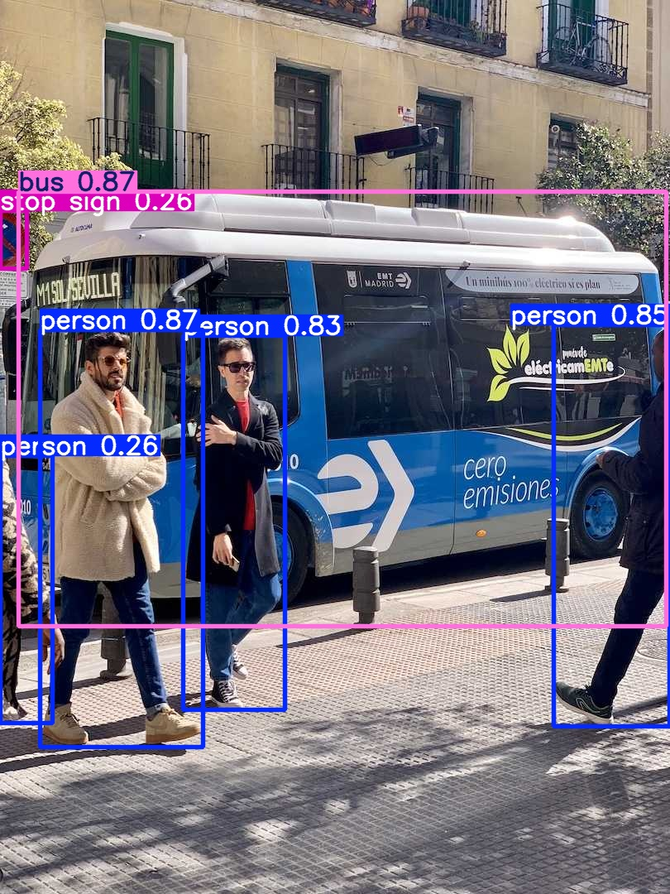

# AI/ML Object Detection using YOLOv8
YOLOv8 deep learning model for real-time object detection in computer vision applications. YOLOv8 is widely used in industries such as robotics, autonomous driving, and video surveillance.

## Description
In this demonstration, I will use YOLOv8 to detect the objects in a ".jpg" and ".avi" files and out put results as demonstrated below:

## Technologies Used

## Repository
- GitHub: [AI/ML Object Detection using YOLOv8](https://github.com/MegAgainDev/ai-mlaas-object-detection-YOLOv8/)
